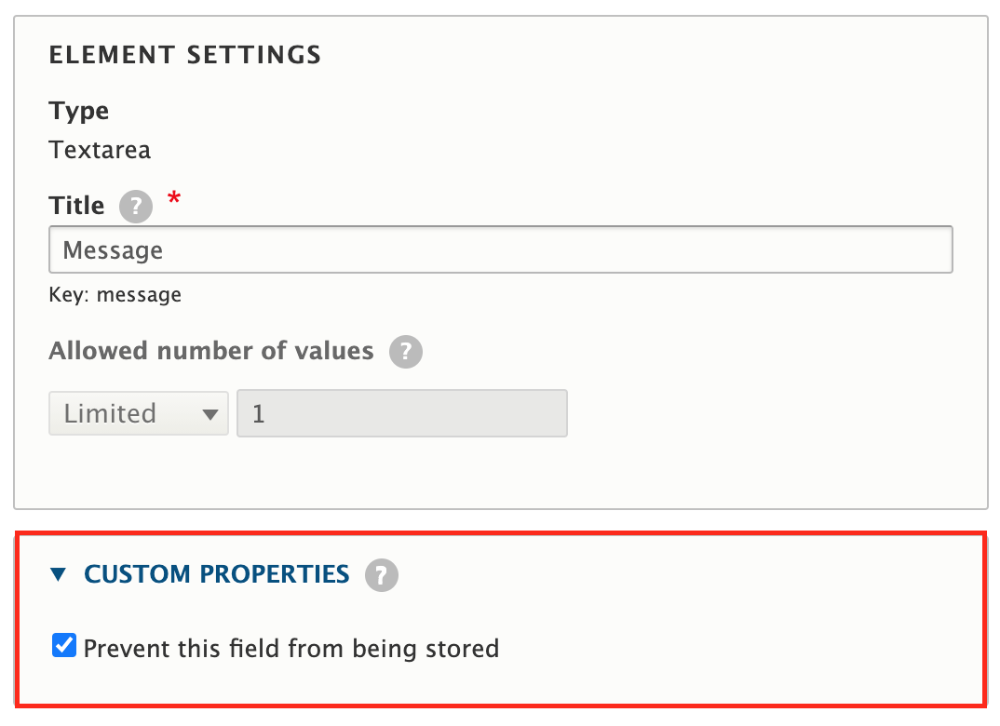

# Vactory Webform Storage

Ce module permet d'ajouter un checkbox au niveau du formulaire de configuration des champs des différents webform du site.
Ce champ permet de définir les champs qui ne doivent pas être stockés dans la BDD.

## Table of Contents
 * [Requirements](#Requirements)
 * [Installation](#Installation)
 * [Configuration](#Configuration)
 * [Maintainers](#Maintainers)

### Requirements

Module :

- webform

Ce module dépend aussi du patch `profiles/contrib/vactory_starter_kit/patches/webform-post-handlers-hook.patch`

Ce patch expose un hook qui permet de modifier une soumission d'un webform juste après l'exécution des webform handlers.

### Installation:
`drush en vactory_webform_storage`

#### Configuration:

La configuration se fait au niveau du formulaire de configuration du champ concerné.

#### Maintainers
Rida Bouharras <r.bouharras@void.fr>
